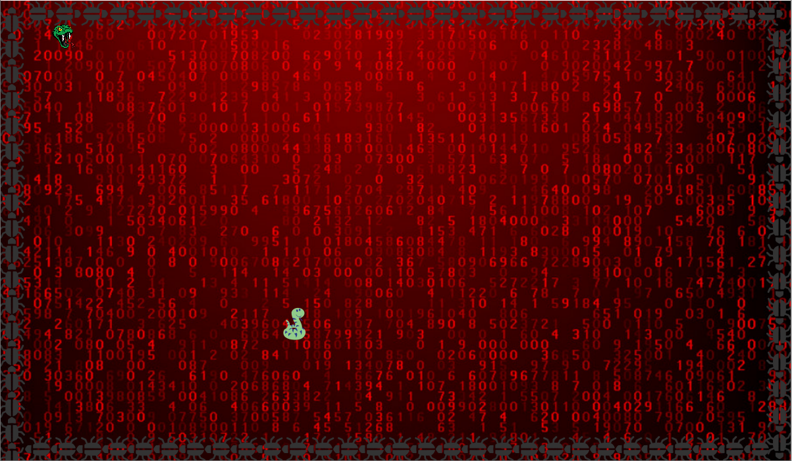

# Python-With-Python

<i><h3>This repository contains EXE file of Python's Corona game</h3></i>

<h4>Just Download EXE File Others Are Not Necessary</h4>

It is a simple game developed by Tkinter #python. This game is developed on a theme of PYTHON PROGRAMMING LANGUAGE AS HERO.
There is a lot of things need to update in this game. But it is still quite a good game to play.
Don't delete any files unless you wanna make mess up with program.

